# CIN — Civic Intelligence Network

**A multi-tenant civic participation OS.** One codebase, one deployment, unlimited institutions — each fully isolated, rebranded, and feature-scoped. Built to turn informal, gameable polling (notice boards, WhatsApp forwards) into a verified, auditable 4-stage trust pipeline, with **Cisco Webex** doing the real work of routing a proposal to the humans who can act on it.

> **Hackathon:** Cisco Capture The Silver Flag 2026 <br> **Team:** Outliers (3 members) <br>
> **Repo:** `github.com/AdityaRaj1010/CiscoCIN`

---

## 📺 Demo Materials

| Asset | Link |
|---|---|
| 🌐 Live deployment | *[https://cisco-cin.vercel.app](https://cisco-cin.vercel.app/)* |
| 💻 Source | `github.com/AdityaRaj1010/CiscoCIN` |
<!-- | 📊 Hackathon report deck | `CIN_Report_Deck.pptx` (in this repo) | -->
<!-- | 🎥 Video walkthrough | *[Paste video link here]* | -->

---

## Table of Contents

1. [The Problem](#the-problem)
2. [Who It's For](#who-its-for)
3. [What Changes — Impact](#what-changes--impact)
4. [How It Works — The 4-Stage Trust Pipeline](#how-it-works--the-4-stage-trust-pipeline)
5. [Step-by-Step Walkthrough](#step-by-step-walkthrough) *(with screenshots + source files)*
6. [Tech Stack](#tech-stack)
7. [Cisco Technology Integration](#cisco-technology-integration)
8. [Architecture](#architecture)
9. [Database Schema](#database-schema)
10. [Project Structure](#project-structure)
11. [Getting Started](#getting-started)
12. [Environment Variables](#environment-variables)
13. [API Reference](#api-reference)
14. [What's Real vs. Simulated (Honesty Section)](#whats-real-vs-simulated)
15. [Roadmap](#roadmap)
16. [Team](#team)

---

## The Problem

Civic participation at the institutional level — a students' union, a Gram Sabha, an RWA, an NGO — is broken in a very specific way:

- Proposals live on **notice boards and WhatsApp groups**, with no verifiable one-person-one-vote.
- There is **no tamper-proof, verified voting** — polls are trivially gamed by repeat or fake submissions.
- There is **no real-time, grouped visibility** into where support actually stands across wards, departments, or constituencies.
- There is **no automatic handoff** from "many people support this" to the desk of someone who can actually act on it.
- Every institution **improvises its own ad hoc process** instead of sharing one trusted rail.

## Who It's For

CIN is provisioned **per tenant** — fully isolated, rebranded, and feature-scoped for the body running it:

- **Students' unions** — department reps and general members voting on campus proposals
- **Panchayats / Gram Sabhas** — ward residents deciding local governance issues
- **NGOs and cooperative societies** — member ballots on organizational decisions
- **Resident welfare associations (RWAs)** — society-level budgeting and maintenance votes
- **Admins, councils, and committees** — the people who act once a proposal is escalated
- Any new institution can be **self-provisioned** in minutes via the built-in tenant provisioner (see [Step 12](#step-by-step-walkthrough))

## What Changes — Impact

- **One-person-one-vote** replaces gameable paper polls and WhatsApp forwards.
- **Live ward/department tallies** build public trust in the outcome, not just the process.
- **Threshold-to-Webex** collapses days of manual follow-up into seconds.
- Turns informal polling into a **measurable, audit-ready institutional trust pipeline.**
- Every tenant gets its **own dashboard** of engagement and turnout over time.

## How It Works — The 4-Stage Trust Pipeline

Every proposal moves through the same four stages, defined once in [`cin/lib/pipeline.ts`](./cin/lib/pipeline.ts) and rendered everywhere as a status strip or a compact chip:

| # | Stage (code) | Label | What happens |
|---|---|---|---|
| 1 | `notice` | **Notice & Input** | Raised and open for the community to weigh in. |
| 2 | `trust` | **Trust Filter** | Verified members endorse; duplicates and noise are filtered. |
| 3 | `trigger` | **Trigger to Action** | Vote threshold met — a real Webex Space is created and the proposal is routed to the body that can act. |
| 4 | `verification` | **Verification** | Outcome recorded with photo proof — verified on the transparency ledger. |

---

## Step-by-Step Walkthrough

Each step below names the exact file(s) implementing it. **Paste a screenshot of the running app for each step in the marked spot.**

### Step 1 — Landing page & tenant directory
The public entry point. Lists the live tenants (colleges, panchayats, NGOs) a visitor can pick from.

**File:** [`cin/app/page.tsx`](./cin/app/page.tsx)

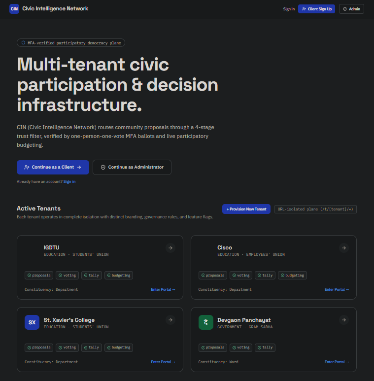
<!-- *(Screenshot: paste the CIN landing / tenant directory page here)* -->

---

### Step 2 — Choose an institution & sign in
Pick a tenant (e.g. St. Xavier's College or Devgaon Panchayat), enter a display name, and continue.

**Files:** [`cin/app/login/page.tsx`](./cin/app/login/page.tsx), [`cin/app/login/login-client.tsx`](./cin/app/login/login-client.tsx)

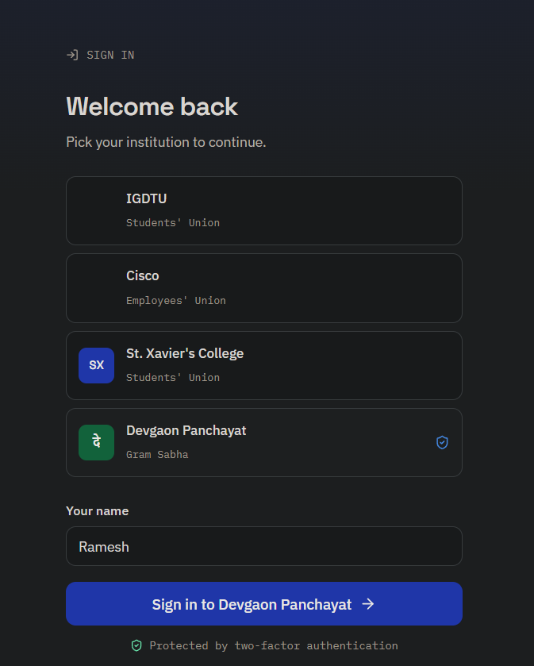
<!-- *(Screenshot: paste the sign-in screen here)* -->

---

### Step 3 — Duo MFA verification
A simulated **Duo Security** push-notification flow gates the sign-in — animated push → checkmark → verified — matching the real Duo Universal Prompt UX pattern.

**File:** [`cin/components/duo-modal.tsx`](./cin/components/duo-modal.tsx)

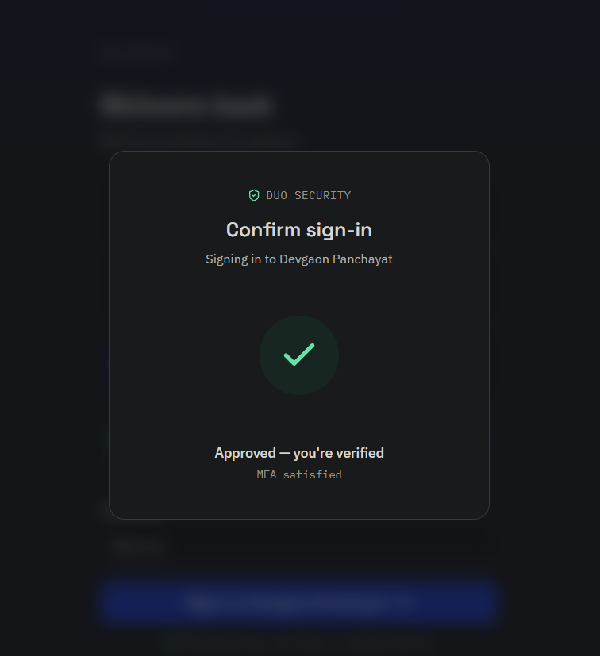
<!-- *(Screenshot: paste the Duo push-verification modal here)* -->

---

### Step 4 — Tenant home, proposal feed & live Slido poll
Once verified, the member lands on their tenant's branded feed — filterable by pipeline stage, sortable by votes/newest — with a **live Slido poll** embedded directly above it.

**Files:** [`cin/app/t/[tenant]/layout.tsx`](./cin/app/t/%5Btenant%5D/layout.tsx), [`cin/app/t/[tenant]/page.tsx`](./cin/app/t/%5Btenant%5D/page.tsx), [`cin/modules/proposals/View.tsx`](./cin/modules/proposals/View.tsx), [`cin/components/slido-embed.tsx`](./cin/components/slido-embed.tsx), [`cin/app/api/config/slido/route.ts`](./cin/app/api/config/slido/route.ts)

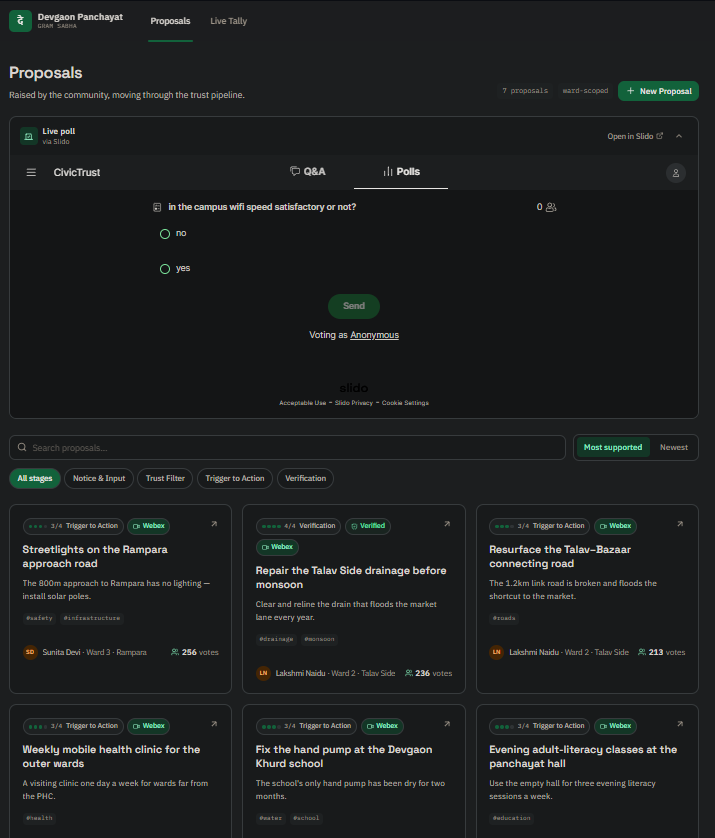
<!-- *(Screenshot: paste the tenant feed with the Slido poll widget here)* -->

---

### Step 5 — Proposal detail & the 4-stage pipeline strip
Opening a proposal shows its full detail plus a visual strip of where it sits in the Notice → Trust → Trigger → Verification pipeline.

**Files:** [`cin/app/t/[tenant]/p/[id]/page.tsx`](./cin/app/t/%5Btenant%5D/p/%5Bid%5D/page.tsx), [`cin/app/t/[tenant]/p/[id]/detail-client.tsx`](./cin/app/t/%5Btenant%5D/p/%5Bid%5D/detail-client.tsx), [`cin/components/pipeline.tsx`](./cin/components/pipeline.tsx), [`cin/lib/pipeline.ts`](./cin/lib/pipeline.ts)

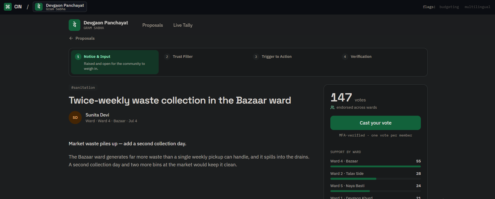
<!-- *(Screenshot: paste a proposal detail page here)* -->

---

### Step 6 — Endorse / cast a vote (one-person-one-vote)
Tapping **Endorse** posts to the vote API. One-person-one-vote is enforced at the **database level** — a unique constraint on `(tenant_slug, proposal_id, user_id)` — not just in application code.

**Files:** [`cin/app/api/t/[tenant]/proposals/[id]/vote/route.ts`](./cin/app/api/t/%5Btenant%5D/proposals/%5Bid%5D/vote/route.ts), [`cin/lib/votes.ts`](./cin/lib/votes.ts), [`cin/supabase/migrations/0001_init.sql`](./cin/supabase/migrations/0001_init.sql)

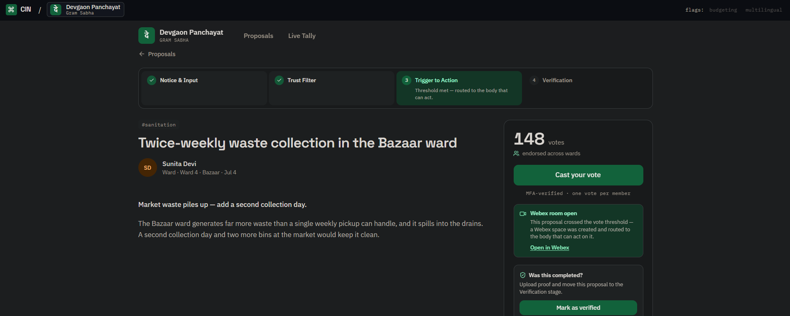
<!-- *(Screenshot: paste the endorse/vote action + updated tally here)* -->

---

### Step 7 — Vote threshold crossed → automatic Webex Space created
This is the **primary Cisco integration**. The moment a proposal's real (non-seed) vote count crosses its threshold, CIN calls the **Webex REST API** to create a brand-new Space, adds the configured moderator(s) to it (so it shows up in *their own* Webex client, not just the bot's), posts the proposal summary plus a link back into CIN, and drops in an Adaptive Card ballot for continued voting — all automatically, and the proposal advances to **Trigger to Action**.

**Files:** [`cin/lib/cisco/webex-pipeline.ts`](./cin/lib/cisco/webex-pipeline.ts), [`cin/lib/cisco/webex.ts`](./cin/lib/cisco/webex.ts), [`cin/supabase/migrations/0003_webex_pipeline_rooms.sql`](./cin/supabase/migrations/0003_webex_pipeline_rooms.sql)

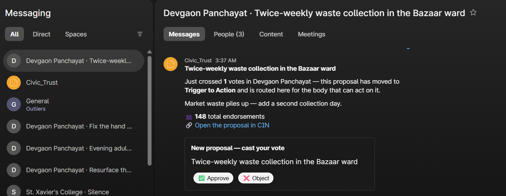
<!-- *(Screenshot: paste the real Webex Space that got auto-created, from your own Webex client)* -->

---

### Step 8 — Live tally dashboard
A grouped, animated live tally — by department or ward — that ticks as votes land, giving the tenant a real-time read on constituency-level support.

**Files:** [`cin/app/t/[tenant]/[module]/page.tsx`](./cin/app/t/%5Btenant%5D/%5Bmodule%5D/page.tsx), [`cin/app/t/[tenant]/[module]/dispatcher.tsx`](./cin/app/t/%5Btenant%5D/%5Bmodule%5D/dispatcher.tsx), [`cin/modules/tally/View.tsx`](./cin/modules/tally/View.tsx), [`cin/app/api/t/[tenant]/tally/route.ts`](./cin/app/api/t/%5Btenant%5D/tally/route.ts)

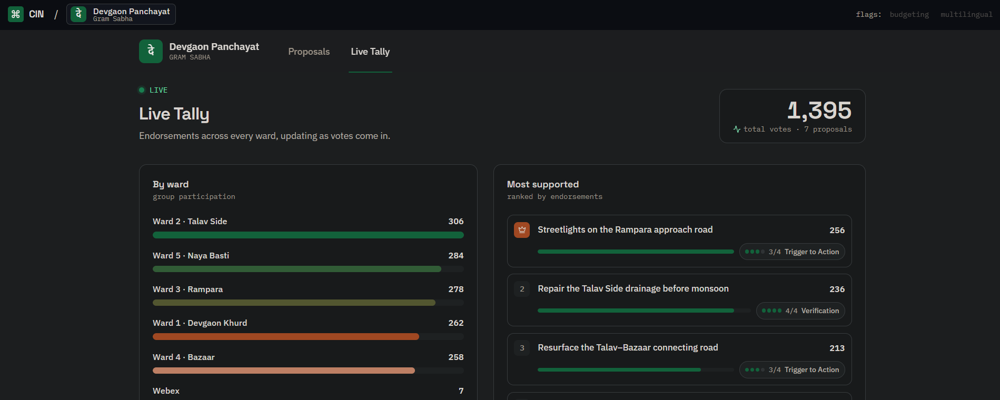
<!-- *(Screenshot: paste the live tally / dashboard view here)* -->

---

### Step 9 — Participatory budgeting
A tenant-enabled module where proposals compete for allocation against a shared budget pool — currently live for tenants that opt in (e.g. St. Xavier's College).

**File:** [`cin/modules/budgeting/View.tsx`](./cin/modules/budgeting/View.tsx)

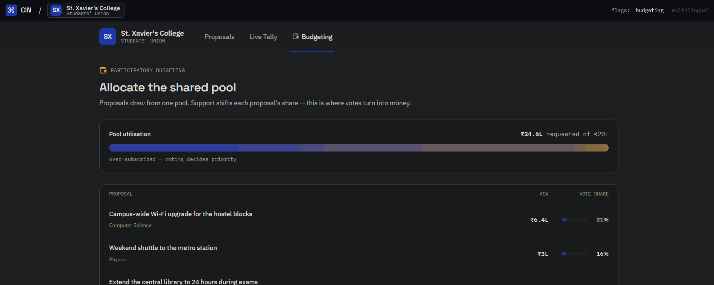
<!-- *(Screenshot: paste the budgeting module here)* -->

---

### Step 10 — Outcome verification (the transparency ledger)
The pipeline's 4th stage isn't just a label — a proposal only reaches **Verification** once someone uploads photo proof (and an optional note) of the completed outcome. This closes the loop from "vote" to "proof of delivery."

**Files:** [`cin/components/verify-proposal-modal.tsx`](./cin/components/verify-proposal-modal.tsx), [`cin/app/api/t/[tenant]/proposals/[id]/verify/route.ts`](./cin/app/api/t/%5Btenant%5D/proposals/%5Bid%5D/verify/route.ts), [`cin/supabase/migrations/0004_outcome_verification.sql`](./cin/supabase/migrations/0004_outcome_verification.sql)

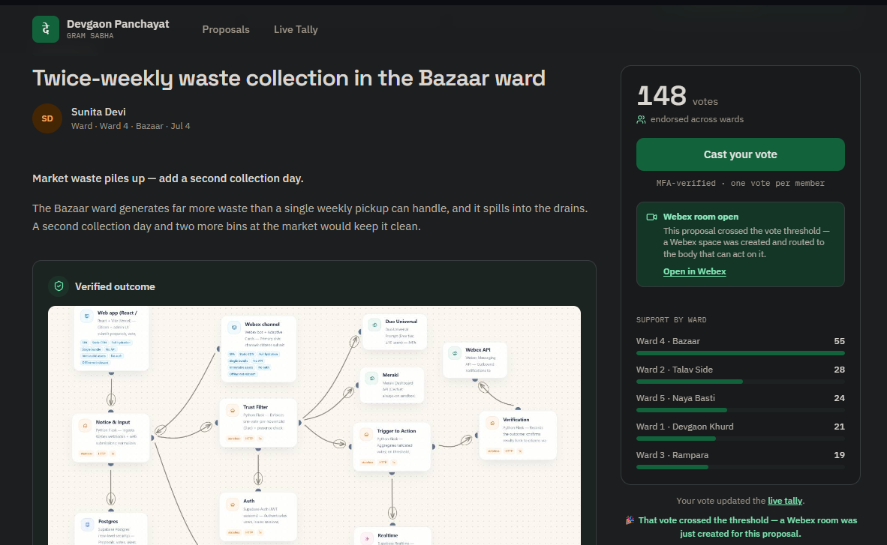
*(Screenshot: paste the verification upload / verified badge here)*

---

<!-- ### Step 11 — Multilingual toggle (Bhashini-ready)
A language context and toggle sit ready in the shell for every tenant — a slot reserved for a live **Bhashini** translation API integration so every resident, regardless of language, can participate.

**Files:** [`cin/context/LanguageContext.tsx`](./cin/context/LanguageContext.tsx), [`cin/components/language-toggle.tsx`](./cin/components/language-toggle.tsx)


*(Screenshot: paste the language toggle in the tenant shell here)*

--- -->

### Step 11 — Self-service tenant provisioner
Any new institution — college, panchayat, NGO — can be spun up live from a form: name, sector, primary/accent brand colors, and which of the several feature modules to enable. It goes live in the tenant directory immediately, fully themed.

**Files:** [`cin/app/provision/page.tsx`](./cin/app/provision/page.tsx), [`cin/app/provision/provision-client.tsx`](./cin/app/provision/provision-client.tsx), [`cin/app/api/tenants/route.ts`](./cin/app/api/tenants/route.ts)

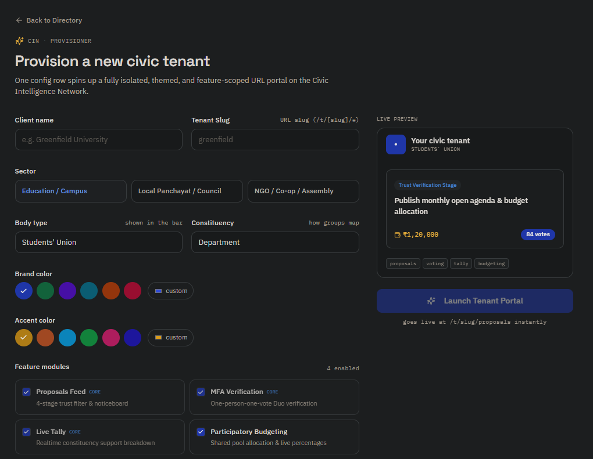
<!-- *(Screenshot: paste the "create a new tenant" form here)* -->

---

### Step 12 — Admin console
A gated (mock-Duo-verified) admin view listing every active tenant across the platform — the control-plane counterpart to each tenant's own data-plane.

**Files:** [`cin/app/admin/login/page.tsx`](./cin/app/admin/login/page.tsx), [`cin/app/admin/page.tsx`](./cin/app/admin/page.tsx), [`cin/app/admin/sign-out.tsx`](./cin/app/admin/sign-out.tsx)

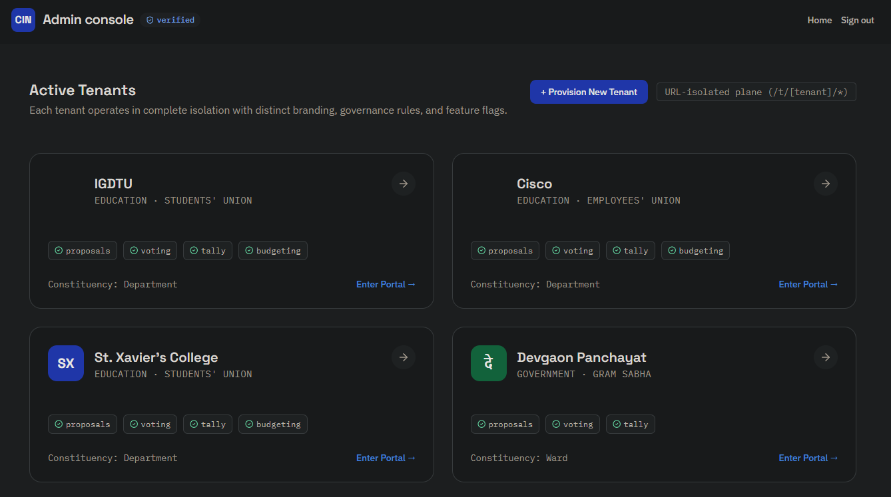
<!-- *(Screenshot: paste the admin tenant directory here)* -->

---

## Tech Stack

| Layer | Technology |
|---|---|
| Framework | **Next.js 15** (App Router, Route Handlers) |
| UI | **React 19**, **TypeScript**, **Tailwind CSS 4** |
| Icons | `lucide-react` |
| Database | **PostgreSQL** via **Supabase**, accessed with the `postgres` (postgres.js) driver |
| Data security | Row-Level Security (RLS) on every table; anon read / service-role write policies |
| Session | HTTP-only per-tenant voter cookie (`cin_voter_<tenant>`) |
| Multi-tenancy | Path-based routing (`/t/[tenant]/...`) with an optional subdomain rewrite in `middleware.ts` |
| Live polling | **Slido** (iframe embed, event ID served from a server-only route) |
| Deployment target | Vercel-style Next.js hosting + a managed Postgres instance (Supabase) |
| Original UI prototype | Vite + React (`src/`) — the pre-port hackathon-day clickable demo, kept in the repo for reference |

## Cisco Technology Integration

CIN's core pitch is that **Cisco Webex is the action layer**, not a bolt-on notification. Here's exactly what's live vs. reserved:

### ✅ Webex REST API — fully live
- **Rooms API** (`POST /v1/rooms`) — creates a real Webex Space per proposal the moment its vote threshold is crossed.
- **Memberships API** (`POST /v1/memberships`) — adds real people (by email) to that Space so it appears in *their own* Webex client.
- **Messages API** (`POST /v1/messages`) — posts the proposal summary and a link back into CIN.
- **Adaptive Cards** — posts a ballot card (`Approve` / `Object`) so voting can continue from inside Webex.
- **Webhooks** (`messages.created`, `attachmentActions.created`) — the inbound path (Step 14): `X-Spark-Signature` HMAC-SHA1 verified against the raw body before anything is trusted; the bot's own messages are filtered out to avoid a reply loop.
- **File:** [`cin/lib/cisco/webex.ts`](./cin/lib/cisco/webex.ts) — the full wrapper, with field notes on every undocumented Webex behavior discovered while building this (webhook payloads never include the message body, deep-link reconstruction for a Space since Webex has no public web URL for one, etc.)

### 🟡 Duo Security — simulated, architected for a live swap-in
- Every sign-in and every vote is gated by a **Duo-style push-verification modal**: animated push → device approval → checkmark, matching the real Duo Universal Prompt UX.
- `DUO_MODE=mock` in the current build — there is no live call to Duo's API yet. The modal sits behind the exact seam a real `@duosecurity/duo_universal` call would occupy (`onVerified()` callback), so swapping in live Duo is a backend change, not a UI rewrite.
- **File:** [`cin/components/duo-modal.tsx`](./cin/components/duo-modal.tsx)

### ⚪ Meraki — reserved, not yet wired
- An org-scoped API key slot (`MERAKI_API_KEY`, `MERAKI_ORG_ID`) is reserved in `.env.example` for a future network- and location-aware civic engagement layer (e.g. verifying a vote was cast from an on-campus or on-premise network).
- Not called anywhere in the current codebase — listed transparently as a roadmap item, not a shipped feature.

### ✅ Slido — fully live
- Embedded as a **live polling widget** directly above every tenant's proposal feed — not the full Slido event/Q&A wall, just the `/polls` view, since that's what fits the "poll the room the moment you enter a tenant" ask.
- The event ID lives server-side in `SLIDO_EVENT_ID` and is handed to the client through a tiny API route rather than a `NEXT_PUBLIC_` env var — not because it's secret (it ends up in the iframe `src` the moment the page loads anyway), but so it stays server-controlled and nothing needs renaming later.
- If `SLIDO_EVENT_ID` isn't configured, the embed renders nothing — tenants/environments without a poll set up see no change at all, no broken iframe.
- Collapsible in the UI (chevron toggle) so it doesn't permanently eat space above the feed, plus an "Open in Slido" link out to the full event.
- **Files:** [`cin/components/slido-embed.tsx`](./cin/components/slido-embed.tsx), [`cin/app/api/config/slido/route.ts`](./cin/app/api/config/slido/route.ts)

## Architecture

**The core rule: the feature flag is the router, not a conditional.** A module that's off for a tenant doesn't render a hidden nav item — its URL 404s. An unknown tenant slug 404s; it never silently falls back to a default tenant (an earlier version of the prototype did this, which is the shape of a cross-tenant data leak).

```
Browser
  │
  ▼
middleware.ts  ──────────►  rewrites a subdomain (acme.cin.app) to /t/acme/...
  │
  ▼
app/t/[tenant]/layout.tsx  ─►  resolves the tenant row → theme (CSS vars) + nav
  │
  ▼
app/t/[tenant]/[module]/page.tsx  ─►  THE DISPATCHER
  │
  ▼
modules/views.tsx  ─►  component map, keyed by module id
  │
  ▼
modules/<name>/View.tsx  ─►  the actual screen
```

Every module is a **manifest** (pure data — id, label, `kind: 'page' | 'capability'`, `status: 'live' | 'preview'`, optional `core`) registered once in `modules/registry.ts`. `voting` is a `capability` module — it has no route, it just gates behavior inside other modules (like the Endorse button).

| Module | Kind | Status |
|---|---|---|
| `proposals` | page (core) | 🟢 live |
| `voting` | capability (core) | 🟢 live |
| `tally` | page (core) | 🟢 live |
| `budgeting` | page | 🟢 live |
| `townhalls` | page | 🟡 preview |
| `petitions` | page | 🟡 preview |
| `polls` | page | 🟡 preview |
| `elections` | page | 🟡 preview |
| `committees` | page | 🟡 preview |
| `noticeboard` | page | 🟡 preview |
| `surveys` | page | 🟡 preview |
| `analytics` | page | 🟡 preview |

Preview modules render a stubbed "coming soon" screen but are already registered and themeable — flipping one to `live` is a per-tenant config change, not a rebuild.

## Database Schema

Four tables, `tenants` → `users` / `proposals` → `votes`, all with Row-Level Security enabled.

```sql
tenants (id, slug UNIQUE, name, sector, body_type, constituency_label,
         features TEXT[], branding JSONB, webex_room_id UNIQUE,
         vote_threshold INTEGER, created_at)

users (id, tenant_slug → tenants.slug, name, role, constituency,
       avatar_initials, created_at)

proposals (id, tenant_slug → tenants.slug, title, summary, body,
           author_id → users.id, stage CHECK IN
             ('notice','trust','trigger','verification'),
           seed_votes_by_constituency JSONB, budget_ask, tags TEXT[],
           source CHECK IN ('web','webex'), webex_message_id,
           webex_room_id UNIQUE, webex_room_created_at,
           verification_note, verification_photo, verified_by,
           verified_at, created_at)

votes (id, tenant_slug → tenants.slug, proposal_id → proposals.id,
       user_id → users.id, created_at,
       UNIQUE (tenant_slug, proposal_id, user_id)  -- one-person-one-vote, enforced by Postgres
)
```

**Migration history** ([`cin/supabase/migrations/`](./cin/supabase/migrations)):
1. `0001_init.sql` — base schema, indexes, RLS policies, the one-person-one-vote unique constraint
2. `0002_webex.sql` — `webex_room_id` on tenants (inbound bot routing), `source`/`webex_message_id` on proposals
3. `0003_webex_pipeline_rooms.sql` — per-proposal `webex_room_id` for the outbound (primary) vote-threshold flow, plus per-tenant `vote_threshold` override
4. `0004_outcome_verification.sql` — the verification columns that back Stage 4's "recorded and verified" claim, plus a data-fix for two seed rows that previously claimed verification with no evidence

## Project Structure

```
CIN-Civic_Intelligence_Network/
├─ src/                         ← original Vite+React hackathon-day prototype (reference only)
├─ cin/                         ← the real Next.js app
│  ├─ middleware.ts               subdomain → /t/[tenant] dispatcher
│  ├─ app/
│  │  ├─ page.tsx                 landing + tenant directory
│  │  ├─ login/, signup/          member sign-in / sign-up
│  │  ├─ provision/                self-service tenant provisioner
│  │  ├─ admin/                   platform admin console
│  │  ├─ t/[tenant]/              ← DATA PLANE (per-institution app)
│  │  │  ├─ layout.tsx              theme + nav from the tenant row
│  │  │  ├─ [module]/               THE DISPATCHER
│  │  │  └─ p/[id]/                 proposal detail
│  │  └─ api/
│  │     ├─ tenants/                provisioning endpoint
│  │     ├─ webex/webhook/          inbound Webex bot (messages + ballot actions)
│  │     ├─ config/slido/           serves the Slido event id
│  │     └─ t/[tenant]/proposals/   vote + verify + list endpoints
│  ├─ modules/                    registry + manifest + View per feature (12 modules)
│  ├─ components/                 duo-modal, slido-embed, pipeline, proposal-card, ...
│  ├─ lib/
│  │  ├─ cisco/webex.ts             Webex REST wrapper
│  │  ├─ cisco/webex-pipeline.ts    vote-threshold → auto Webex room
│  │  ├─ tenant.ts, data.ts, votes.ts, pipeline.ts, db.ts
│  └─ supabase/migrations/        0001 → 0004, plus seed.sql
├─ cin-build-spec.md            the original architecture spec this was built from
├─ WEBEX_INTEGRATION.md         full design + setup for the Webex integration
└─ AUDIT_AND_WEBEX_NOTES.md     field notes / known gaps
```

## Getting Started

```bash
git clone https://github.com/AdityaRaj1010/CiscoCIN.git
cd CiscoCIN/cin

npm install
cp .env.example .env.local
# fill in DATABASE_URL, WEBEX_BOT_TOKEN, etc. — see below

node scripts/run-migrations.mjs   # applies 0001 → 0004 against DATABASE_URL
npm run dev                       # http://localhost:3000
```

To also run the original Vite prototype side-by-side:

```bash
cd ..                # repo root
npm install
npm run dev           # http://localhost:5173
```

## Environment Variables

| Variable | Purpose |
|---|---|
| `DATABASE_URL` | Postgres connection string (Supabase: use the pooled connection URI) |
| `NEXT_PUBLIC_SUPABASE_URL` / `NEXT_PUBLIC_SUPABASE_ANON_KEY` | Supabase client config |
| `SUPABASE_SERVICE_ROLE_KEY` | Server-only — bypasses RLS for writes |
| `WEBEX_BOT_TOKEN` | Bot token for all Webex API calls |
| `WEBEX_BOT_PERSON_ID` | Used to filter out the bot's own webhook events |
| `WEBEX_WEBHOOK_SECRET` | HMAC secret for verifying inbound Webex webhooks |
| `WEBEX_VOTE_THRESHOLD` | Real votes needed before a Webex room auto-creates (default `5`) |
| `WEBEX_NOTIFY_EMAILS` | Comma-separated emails added to every auto-created room |
| `DUO_MODE` | `mock` (current) or `live` — Duo isn't wired to a real API yet |
| `DUO_CLIENT_ID` / `DUO_CLIENT_SECRET` / `DUO_API_HOST` / `DUO_REDIRECT_URI` | Reserved for live Duo |
| `MERAKI_API_KEY` / `MERAKI_ORG_ID` | Reserved — not called anywhere yet |
| `SLIDO_EVENT_ID` | Slido event to embed above the proposal feed |
| `APP_URL` | Used to build the "open in CIN" link posted into Webex |

## API Reference

| Method | Route | What it does |
|---|---|---|
| `GET` | `/api/tenants` | List all provisioned tenants |
| `POST` | `/api/tenants` | Provision a new tenant |
| `GET` | `/api/t/[tenant]/proposals` | List proposals for a tenant |
| `GET` | `/api/t/[tenant]/proposals/[id]` | Get one proposal |
| `POST` | `/api/t/[tenant]/proposals/[id]/vote` | Cast a vote → may trigger a Webex room |
| `POST` | `/api/t/[tenant]/proposals/[id]/verify` | Submit outcome proof → Stage 4 |
| `GET` | `/api/t/[tenant]/tally` | Live tally data |
| `POST` | `/api/webex/webhook` | Inbound Webex events (messages + ballot actions) |
| `GET` | `/api/config/slido` | Serves the configured Slido event id |

## What's Real vs. Simulated

Being upfront about this is part of the demo, so judges can weigh it accurately:

| Feature | Status |
|---|---|
| Webex Rooms / Memberships / Messages / Webhooks | ✅ Real API calls, real Spaces |
| Postgres data layer, RLS, one-person-one-vote | ✅ Real, enforced at the DB level |
| Multi-tenant routing & self-service provisioning | ✅ Fully functional |
| Duo MFA | 🟡 Simulated UX (`DUO_MODE=mock`) — real API not yet called |
| Meraki | ⚪ Reserved env slot only — no calls made |
| Bhashini multilingual | 🟡 UI toggle + context wired; live translation API not yet connected |
| 8 of 12 feature modules (town halls, petitions, elections, etc.) | 🟡 Registered and themeable, rendering a "preview" stub |

## Roadmap

- Wire `DUO_MODE=live` to the real Duo Universal Prompt API
- Connect Meraki for network/location-aware vote context
- Live Bhashini translation instead of the current toggle stub
- Promote the remaining `preview` modules (elections, petitions, town halls, committees, noticeboard, surveys, polls, analytics) to `live`
- Object storage for verification photos instead of base64-in-Postgres

## Team

**Team Outliers** — 3-member squad, one shipped, working product.

- Pari Gupta
- Chaitanya Virani
- Aditya Raj

**Repo:** `github.com/AdityaRaj1010/CiscoCIN`
